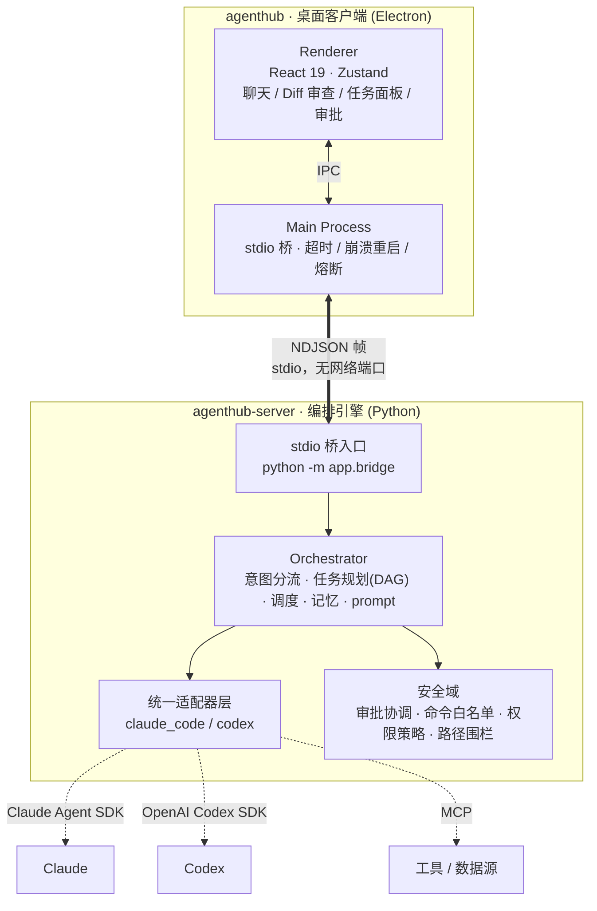

<div align="center">

# AgentHub

**多 AI Agent 协作编码引擎 · Multi-Agent Collaborative Coding Engine**

以「群聊」组织 Planner / Coder / Reviewer / Deployer 等角色 Agent，协同完成端到端编码任务。

[](https://www.python.org/)
[](https://www.typescriptlang.org/)
[](https://www.electronjs.org/)
[](https://fastapi.tiangolo.com/)
[](#-license)

[简介](#-简介) · [架构](#️-架构) · [快速开始](#-快速开始) · [编译与打包](#-编译与打包) · [使用指南](#-使用指南) · [常用命令](#-常用命令) · [配置](#️-配置) · [开发](#-开发)

</div>

---

## 📖 简介

**AgentHub** 是一款多 AI Agent 协作编码桌面应用。不同于「一个对话框 + 一个大模型」的传统形态，它把编码流程拆成可协作的角色 Agent，由一套自研编排引擎统一调度：

- **规划者（Planner）** 把复杂需求拆解为带依赖的任务图；
- **编码者（Coder）** 在隔离的工作区中实现具体任务；
- **审查者（Reviewer）** 对产出裁决，必要时触发修复或重规划；
- **部署者（Deployer）** 执行高危操作，并强制走人工审批闸门。

底层通过**统一适配器层**对接 [Claude Agent SDK](https://docs.anthropic.com/) 与 [OpenAI Codex SDK](https://openai.com/)，编排逻辑与具体模型解耦；客户端经**进程内 stdio 桥**驱动后端引擎，**不监听任何网络端口**，攻击面小、便于随桌面应用一体分发。

> 本仓库是一个 **monorepo**：桌面客户端（`agenthub/`）与编排引擎（`agenthub-server/`）两个同级子项目，由一条 stdio 桥连接、一并打包分发。

---

## ✨ 特性

| 能力 | 说明 |
| --- | --- |
| 🔀 **意图分流** | `direct / single / pipeline` 三级分流，一次大模型调用完成「判意图 + 简单问题直接作答」，简单请求调用次数约 **−75%**，判断失败回退单步执行。 |
| 🕸️ **任务编排（DAG）** | 复杂需求拆为带依赖的任务图；提交前校验依赖合法且无环，执行期按依赖分批调度、无依赖并行、失败级联取消、已完成断点续跑，死锁态兜底。 |
| 🧠 **三层记忆** | 短期（会话）/ 中期（任务间结果）/ 长期（跨会话项目知识）；按真实 token 占用比例分级动态调节注入预算，历史超窗滚动压缩为结构化摘要。 |
| 📋 **计划文档（plan docs）** | 复杂 pipeline 自动把任务计划落盘为可评审 Markdown（需求 / 设计 / 任务三件套，借鉴 Spec Kit），可在右侧「计划」面板逐文件查看与编辑。 |
| 🔌 **统一适配器** | 统一执行接口 + 统一事件流（思考 / 工具调用 / 审批 / 代码改动 / 完成 / 错误）；按健康检查在 Claude → Codex 间自动选择，支持 per-agent 独立供应商与会话 resume。 |
| 🧭 **结构化能力路由** | 借鉴 A2A *Agent Card*，Agent 能力可声明为结构化清单（何时该派 / 不该派 / 输入输出 / 示例），渲染进规划提示，路由更准；未声明时回退自由文本，向后兼容。 |
| 🛡️ **审批与安全闸门** | 审批协调器打通「界面审批」与「Agent 执行阻塞点」并持久化，重启后仍可解除、失败置任务 failed 并提示；高危操作经命令白名单 + 权限策略推导风险等级并二次确认，路径围栏防越权写。 |
| 🔧 **工具接入（MCP）** | 支持本地 stdio / 远程 HTTP 两类 MCP 服务器，按 Agent 能力白名单下发可用工具。 |
| 🖥️ **流式审查 UI** | 流式增量渲染 + 乐观更新；并排 / 行内 Diff、语法高亮与完整文件上下文、多 Agent 向导式逐项审批。 |

---

## 🏗️ 架构



数据流（一次请求）：渲染层 → IPC → 主进程 stdio 桥 → 后端桥入口 → 编排器**意图分流**判定 → （多步则）规划为**任务 DAG** → 调度器按依赖执行 → 各任务经**统一适配器**驱动底层 SDK，事件以统一事件流回传 → 高危动作进**审批闸门** → 结果与 Diff 流式回渲染层审查。

---

## 📂 项目结构

```
.
├── agenthub/                    # 桌面客户端（前端 + Electron 主进程）
│   ├── src/
│   │   ├── main/                # 主进程：拉起后端、stdio 桥、IPC
│   │   │   ├── bridge.ts            # spawn `python -m app.bridge`，NDJSON 收发 / 超时 / 重启 / 熔断
│   │   │   └── serverEnv.ts         # 解析后端目录与 Python 解释器（支持 AGENTHUB_PYTHON）
│   │   ├── preload/             # 预加载脚本（contextBridge 暴露受限 API）
│   │   └── renderer/            # React 渲染层（聊天 / Diff 审查 / 任务面板 / 计划面板 / 审批向导）
│   ├── electron-builder.yml     # 打包配置
│   └── package.json
│
├── agenthub-server/             # 编排引擎 / 适配器层（后端）
│   ├── app/
│   │   ├── bridge.py            # stdio 桥入口
│   │   ├── api/                 # 进程内 ASGI 路由（agents / tasks / approvals / git / plans ...）
│   │   ├── orchestrator/        # 意图分流 · 任务规划(DAG) · 调度执行 · 记忆 · prompt 构建
│   │   ├── adapters/            # 统一适配器：claude_code / codex
│   │   ├── memory/              # 三层记忆：会话窗口 / 滚动摘要 / 项目级长期记忆
│   │   ├── security/            # 审批协调 · 命令白名单 · 权限策略 · 路径围栏
│   │   ├── services/            # diff 构建 · git 面板 · 任务 / 审批 / 计划落盘(plan_store)
│   │   ├── db/                  # SQLAlchemy 模型 · 引擎与轻量迁移
│   │   └── schemas.py           # 对外数据契约（Pydantic，camelCase 出入）
│   ├── agents/                  # 角色定义（*.md，首启 seed 进 DB）
│   ├── config/                  # adapters.yaml / mcp.yaml
│   └── pyproject.toml
│
└── README.md
```

---

## 🚀 快速开始

### 前置要求

- **Node.js** ≥ 18（建议 20 LTS）+ npm
- **Python** 3.11
- **独立 Python 环境（推荐）**：建议用一个**装好 Agent SDK** 的独立环境（venv 或 conda，名称自取）运行后端/测试/脚本；避免用未装 SDK 的系统/base `python`，否则运行时探测不到适配器会导致任务空跑。
- **解释器解析优先级**：客户端按 `AGENTHUB_PYTHON`（完整路径）> `AGENTHUB_CONDA_ENV`（环境名）> PATH 上的 `python` 定位后端解释器；设置其一指向你的环境即可。
- 至少一个 Agent SDK（`claude-agent-sdk` 或 `openai-codex`）；运行时按健康检查自动探测可用性。

### 1️⃣ 后端（agenthub-server）

```bash
cd agenthub-server

# 独立环境（venv 或 conda 均可，名称自取）
python3.11 -m venv .venv && source .venv/bin/activate   # 或：conda create -n <env> python=3.11 -y && conda activate <env>

# 安装依赖（二选一）
pip install poetry && poetry install --extras all      # 方式 A：poetry
pip install -e ".[all]"                                 # 方式 B：pip 可编辑安装
```

> `--extras all` 同装 Claude + Codex SDK；只装其一可用 `--extras claude` 或 `--extras codex`。

### 2️⃣ 客户端（agenthub）

```bash
cd agenthub
npm install

# 指定后端解释器（任选其一；或先 `conda activate <env>` 让 PATH 指向该环境）
#   按环境名 : export AGENTHUB_CONDA_ENV=<env>           # Windows(PowerShell): $env:AGENTHUB_CONDA_ENV="<env>"
#   按路径   : export AGENTHUB_PYTHON=/path/to/python   # Windows(PowerShell): $env:AGENTHUB_PYTHON="C:\path\to\python.exe"
```

### 3️⃣ 运行（开发态）

```bash
cd agenthub
npm run dev          # 启动开发态客户端（热更新），会自动拉起后端 stdio 桥
```

> 客户端启动时会按 `serverEnv.ts` 的解析顺序找到 Python，并 `spawn python -m app.bridge` 拉起后端；**无需手动单独启动后端**。

---

## 📦 编译与打包

打包由 `agenthub/` 下的 electron-builder 完成，后端作为 `resources/agenthub-server` 一并打进应用。

```bash
cd agenthub

# 仅编译（typecheck + electron-vite build，产物在 out/）
npm run build

# 不签名快速产物（验证打包流程，输出到 dist/ 的 --dir 解包目录）
npm run build:unpack

# 平台安装包
npm run build:win    # Windows 安装包（nsis）
npm run build:mac    # macOS dmg
npm run build:linux  # Linux AppImage / snap / deb
```

> 运行期后端目录：开发期取仓库同级 `../agenthub-server`，打包后取 `process.resourcesPath/agenthub-server`（见 `src/main/serverEnv.ts`）。打包产物仍依赖目标机器上可用的 Python 环境。

---

## 🧭 使用指南

1. **新建会话**：会话即一组协作角色 Agent 的「群聊」。首次给会话发任务消息时，AgentHub 会为该会话创建独立工作区。
2. **下达需求**：在输入框直接描述需求并发送。编排器先做**意图分流**：
   - `direct`：闲聊 / 简单问答，Orchestrator 一次直接作答，不派下游任务；
   - `single`：派 1 个角色 Agent 执行；
   - `pipeline`：拆成带依赖的任务 DAG，多角色协作完成。
3. **计划文档**：`pipeline` 模式会把任务计划落盘为可评审 Markdown（需求 / 设计 / 任务三件套），点右侧 **「计划」** 面板可逐文件查看 / 编辑；改完用「修改计划」反馈给规划层重新拆解。
4. **定向与命令**：
   - `@<角色>`：把消息直达指定角色（如 `@coder 改这里`、`@reviewer 审查`）；
   - `/plan` 出计划、`/tasks` 看进度等斜杠命令。
5. **审查与审批**：代码改动以**流式 Diff**呈现（并排 / 行内、语法高亮）；高危操作（如部署）走**向导式逐项审批**，确认后才执行。
6. **右侧面板**：审查（review）/ 任务（task）/ 计划（plan）/ Git / 预览（preview）随任务进展切换。

---

## 📋 常用命令

### 后端（在 `agenthub-server/`，先激活 conda 环境）

| 命令 | 说明 |
| --- | --- |
| `poetry install --extras all` | 安装依赖（含 Claude + Codex SDK） |
| `python -m app.bridge` | 手动启动 stdio 桥后端（一般由客户端自动拉起，调试时可单跑） |
| `python -m pytest -q` | 运行测试 |
| `python -m pytest --cov=app` | 测试 + 覆盖率（pytest-cov） |
| `ruff check app/` | Lint（line-length 100） |
| `ruff check --fix app/` | Lint 并自动修复 |
| `black app/` | 代码格式化 |
| `mypy app/` | 静态类型检查（strict） |

### 前端（在 `agenthub/`）

| 命令 | 说明 |
| --- | --- |
| `npm run dev` | 开发态客户端（热更新，自动拉起后端） |
| `npm run start` | 预览已构建产物（electron-vite preview） |
| `npm run build` | 类型检查 + 编译（electron-vite build） |
| `npm run build:win` / `:mac` / `:linux` | 平台安装包 |
| `npm run build:unpack` | 不签名解包产物（验证打包） |
| `npm run typecheck` | TS 类型检查（node + web 双 tsconfig） |
| `npm run lint` | ESLint |
| `npm run format` | Prettier 格式化 |

---

## ⚙️ 配置

### 环境变量

后端配置经环境变量 / `agenthub-server/.env`（前缀即字段名，大小写不敏感）：

| 变量 | 默认 | 说明 |
| --- | --- | --- |
| `HOST` | `0.0.0.0` | 进程内 ASGI 监听地址（一般无需改） |
| `PORT` | `8642` | 端口 |
| `DEBUG` | `false` | 调试日志 |
| `AUTO_COMMIT_ON_TASK` | `false` | 写型任务成功后是否自动 `git commit`；默认仅 `git add` 暂存，避免意外推进基线 |
| `AGENTHUB_MAX_REPLAN_ATTEMPTS` | `1` | 失败重规划封顶轮数（`0` = 关闭重规划） |
| `AGENTHUB_MAX_CLARIFY_ROUNDS` | `1` | 规划期澄清轮数上限（`0` = 禁用澄清） |
| `AGENTHUB_PENDING_PLAN_TTL_S` | `1800` | 计划确认门禁的暂存存活上限（秒） |
| `AGENTHUB_PYTHON` | — | （客户端）覆盖后端 Python 解释器完整路径 |
| `AGENTHUB_CONDA_ENV` | — | （客户端）按 conda 环境名定位后端 Python |

### 声明式配置文件

- **`agenthub-server/config/adapters.yaml`** — 适配器（Claude / Codex）参数。
- **`agenthub-server/config/mcp.yaml`** — MCP 工具服务器（本地 stdio / 远程 HTTP），可按 Agent 能力白名单下发。
- **`agenthub-server/agents/*.md`** — 角色定义（名称 / 描述 / 结构化能力 / system prompt），首次启动 seed 进数据库。

### 项目级约定（注入到每个 Agent 上下文）

- 全局规则：`~/.agenthub/rules.md`
- 工作区规则 / 宪法：`{workspace}/AGENTHUB.md`
- 跨会话进展：`{workspace}/.agenthub/progress.md`
- 计划文档落盘目录：`{workspace}/.agenthub/plans/`

---

## 🧑‍💻 开发

| 位置 | 命令 | 说明 |
| --- | --- | --- |
| `agenthub` | `npm run dev` | 开发态客户端（热更新） |
| `agenthub` | `npm run typecheck` | TS 类型检查（node + web） |
| `agenthub` | `npm run lint` | ESLint |
| `agenthub` | `npm run format` | Prettier |
| `agenthub-server` | `python -m pytest -q` | 运行测试 |
| `agenthub-server` | `ruff check app/` | Lint（line-length 100） |
| `agenthub-server` | `mypy app/` | 类型检查（strict） |

**提交前**建议跑通：前端 `npm run typecheck && npm run lint`，后端 `python -m pytest -q && ruff check app/`。改动数据契约时记得同步 `agenthub-server/app/schemas.py` 与前端类型。

---

## 🗺️ 路线图

- [ ] 断线重连的事件重放（当前重连对活动会话做一次全量重拉补帧）
- [ ] Diff 大文件虚拟化渲染
- [ ] Agent 结构化能力（skill specs）的前端可视化编辑表单
- [ ] 审查与 git 面板联动（审批通过 → 可视化暂存 / 提交）
- [ ] 演进为分布式 / 多厂商 Agent 互联（A2A 协议）

---

## 🤝 贡献

欢迎 issue 与 PR。提交前请确保通过上表的 lint / typecheck / 测试，并遵循现有代码风格（后端 ruff line-length 100、mypy strict；前端 ESLint + Prettier）。改动数据契约时记得同步 `agenthub-server/app/schemas.py` 与前端类型。

## 📄 License

[MIT](LICENSE) © AgentHub

## 🙏 致谢

- **[MiMo-Code](https://github.com/XiaomiMiMo/MiMo-Code)** — 多处核心设计的重要参考来源：Markdown 驱动的 Agent 定义、真实 token 计量与上下文压力分级（50% / 70% / 85%）、结构化滚动摘要（compaction）模板、超限文本头尾软修剪（soft prune）、多模态附件契约（FilePart）。
- [Claude Agent SDK](https://docs.anthropic.com/) · [OpenAI Codex SDK](https://openai.com/) — 底层编码 Agent 能力
- [Model Context Protocol (MCP)](https://modelcontextprotocol.io/) — 统一工具接入
- [A2A / Agent2Agent](https://github.com/google/A2A) — 结构化能力描述（Agent Card）思想来源
- [GitHub Spec Kit](https://github.com/github/spec-kit) — 计划文档「需求 / 设计 / 任务」三件套形态参考
- [electron-vite](https://electron-vite.org/) · [FastAPI](https://fastapi.tiangolo.com/) · [SQLAlchemy](https://www.sqlalchemy.org/)
